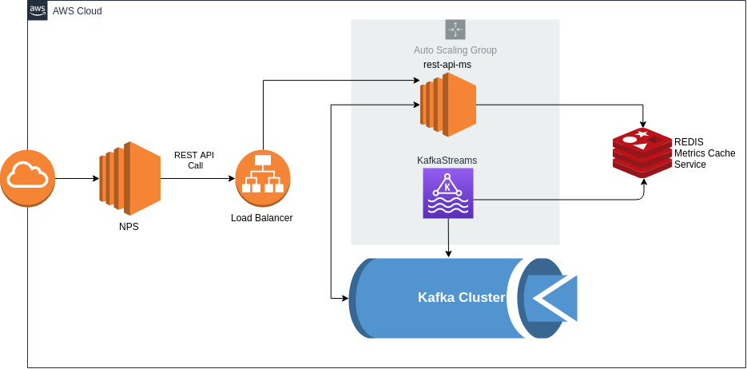
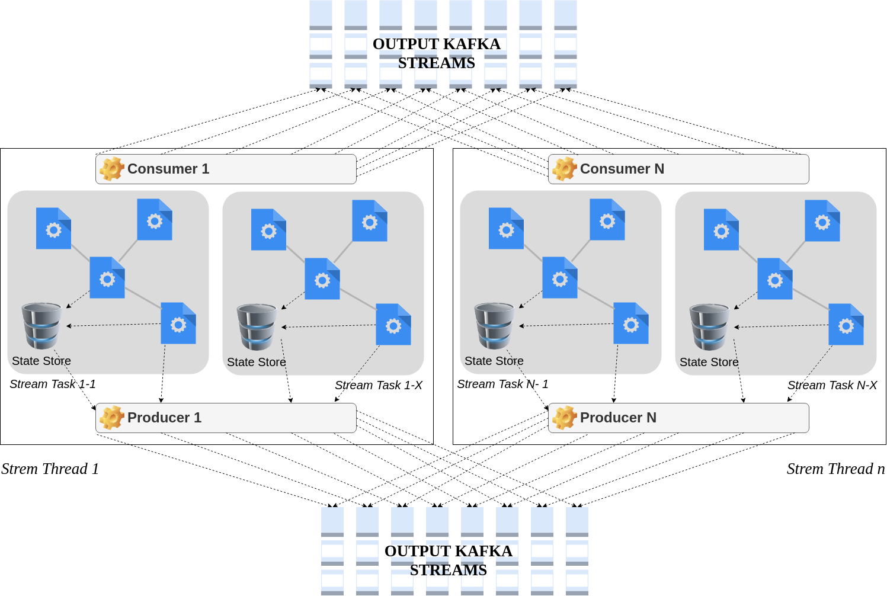
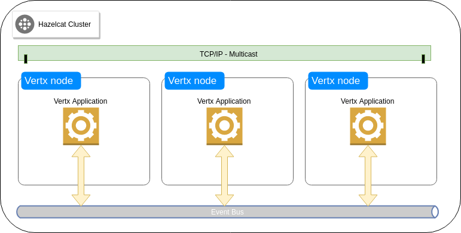
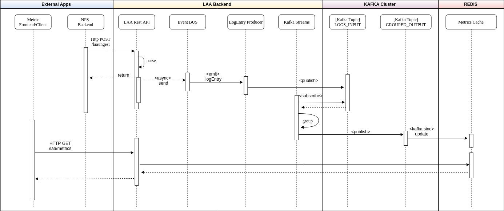

# LAA - Log Access Analytics

## About this
LAA stands for "Log Access Analytics", a custom backend solution to provides logs to NPS(Nabucco's Pet Service). This folder is structured as follows:
* **code** - The code for the backend service
* **devops** - Automation scripts to build and launch the app
* **diagram** - All diagrams to describe the solution and the architecture
* **local-env** - Configuration to demo the solution, and step-by-step process to run it
* **text** - General explanations about the code and architecture
* **video** - video demostrating the app in live action

## Problem statement
Nabuco is a word class CEO. He need to know which pages are having more access on his website. Nabuco has the biggest pet shop in the world called NPS(Nabucco's Pet Service). Mr Nabuco has lots of access around the world. His site is running in 3 AWS(Amazon Web Service) regions being: us-east-1, us-west-2 and ap-south-1. Lucky-ly Nabuco developers wrote a log line every time a user access a webpage. Nabucos uses the best solution around web ui rendering web-assembly(WASM) faster than the speed of light. Here is a example of logs you might find:

* &nbsp;&nbsp; /pets/exotic/cats/10 1037825323957 5b019db5-b3d0-46d2-9963-437860af707f 1

* &nbsp;&nbsp;/pets/guaipeca/dogs/1 1037825323957 5b019db5-b3d0-46d2-9963-437860af707g 2

* &nbsp;&nbsp;/tiggers/bid/now 1037825323957 5b019db5-b3d0-46d2-9963-437860af707e 3

First information is the URL of the site, second we have a timestamp with the user visited that URL. Them right after the timestamp we have the UUID of the user and finally region code being: us-east-1(1), us-west-2(2) and ap-south-1(3).

You need to build a solution that receives(ingest) logs via a REST endpoint and is able to calculate in near-real time all the top metrics like:

* Metric 1 - Top 3 URL accessed all around the world
* Metric 2 - Top 3 URL accessed PER region
* Metric 3 - The URL with less access in all world
* Metric 4 - Top 3 Access per DAY, WEEK, YEAR (you recive the DAY/WEEK/YEAR by parameter)
* Metric 5 - The minute with more access in all URLs

## Architecture bic picture

The main concern about this application could be deducted by the statement above:
* Lots of access
* Response-time needs to be really fast in metrics endpoint

It's a basic description of a streaming application that should handle tons of data and process than to create summarized view of it. The design should be able to provide:
* Strong and highly available rest API to handle the log ingestion
* A streaming mechanism to produce the summarized data in an asynchronous way and make it available just after the calculations, that should be done incrementally. 

So, I'll split this description in two big pictures, each one of them to address one specific feature as described above.

### STREAMING

In order to achieve the multiple processing logic described in the problem statement our system must provide a paralel streaming engine to consume one income resource and produce multiple outcomes based on each needed metric. Kfaka provide such feature using Streams API. 

Kafka Streams simplifies application developtment by building on Kafka consumer and producer APIs, and leveraging the native capabilities of Kafka to offer data parallelism, distributed coordination, fault tolerance and simplicity.

The following diagram describes how the architecture works:

### REST API

Our REST API should be developed in a highly scalable fashion that should be deployed on various instances to handle any amount of data that came from the main website. Each API call should not be blocking and even if our streaming component is offline we should be able to act and consume the messages that couldn't be consumed at the arrival.

#### Vert.x

Vert.x is an event-driven non-blocking application platform that enables us to write concurrent code without having to think too much about concurrency itsel, so we can focus on the application business logic instead of threads and synchornization. A key abstraction is Verticle, which works similarly to actors in the actor model, and besides all this features, it is polyglot, so we can write our components in different languages. 

Another key component is the event bus, which works similarly as a message broker shared with all verticles on all instances of the application cluster. It's very simple to run Vert.x in cluster mode, turning the event bus into a distributed event based broker accross multiple nodes without changing any code. Actually there are four libraries that can be used to run Vert.x in cluster mode, two of them in stable versions Apache Ignite and Hazelcast. The latest one was the choice for this POC basically because of it's really simple to work with.

### Application basic flow

The basics of the log ingestion flow is:
1. The NPS Backend invokes the REST API (Http-POST /laa/ingest) with the log to be ingested;
2. The LAA REST API receives the request, validates and parses it to a LogEntry instance, send the instance to Vertx event bus and return a 201 (accepted) status code to the client with the LogEntry json on the response. All the process from now on is handled on another thread.
3. The LogProducerVerticle is notified that there's a log waiting to be processed. It consumes the message and send it to the kafka input topic (LOGS_INPUT)
4. All the Metrics verticles get notified that the log was sent to the input topic and start processing the KafkaStreams
5. After finishing the aggregation and summarization the final result is published to another topic (output topic)
6. Once the final metric is published to one of the output topics, Kafka sinc sends it to the final cache (Redis) and the metrics are finally persisted.

*For demonstration purposes the component that is sending the output to Redis is implemented on the rest-api-ms project.*

## Aditional information

For more details about each of the following topics please refer to the corresponding link:
 * [code](./code/README.md)
 * [REST API](./text/REST.md)
 * [Solution Evaluation And Enhancements](./text/SOLUTION.md)
 * [Live-demo](./local-env/README.md)
 * [Automation](./devops/README.md)

