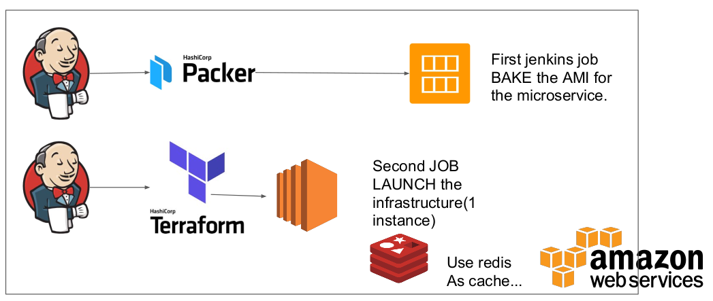
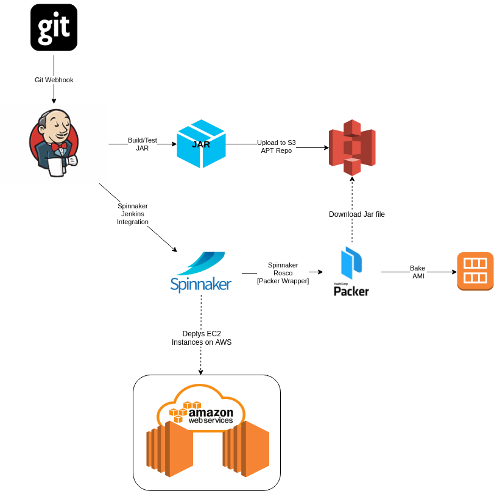

# LAA Devops

The main goal of this section is to describe the build and deploy process, the tools used to each one of the steps and how they integrate with each other. The original devops tools and process sugested on the assignment was:



This structure provides the basics for building and deploying the image, but I guess we can take advantage of other tools to build a more complete end to end process with more flexibility.
Let's take a look on the to-be model:



Instead of using raw scripts of packer and terraform I decided to give a chance to [Spinnaker](https://www.spinnaker.io/)

## DevOps Architecture

Spinnaker's modern [architecture](https://www.spinnaker.io/reference/architecture/) is comprised of several independent microservices and can be installed on most private or public infrastructure. 

From Spinnaker on AWS, Debian Packages are uploaded to the APT package repository on AWS S3. Spinnaker also gakes Amazon Machine Images (AMI) on AWS, previsions the AWS resources, including EC2 instances, Load Balancers, Auto Scaling Groups, Launch Configurations and Security Groups. The only resource that we need to create in advance is VPC and Subnets.

 ## S3 Bucket Repository

 After setting up Spinnaker on AWS, we just need to create an S3 bucket to store the jar files. This step is not required as we could simply use the local build folder to store them, but it can be usefull to store files there.

## Jenkins

We will use a sindle Jenkins CI/CD pipeline, automatically triggered by every git push to the git repository hosting the code. The pipeline pulls the source code, builds the application, and perform unit-tests and static code analysis with SonarQube. If the build succeeds and the tests pass, the build artifact (JAR file) is uploaded to an s3 bucket and archived locally for Spinnaker to reference. 

Once the pipeline is completed, on success or failure, a Slack notification is sent. 

```groovy
#!/usr/bin/env groovy

def GIT_URL = ""

pipeline {
    agent any
    tools { 
        maven 'Maven' 
        jdk 'JAVA_13'
    }
    stages {        
        stage('Clean Up workspace') {
            steps {
                deleteDir()
            }
        }

        stage('Checkout GitHub') {
            steps {
                git changelog: true, poll: false,
                        branch: 'master',
                        url: "${GIT_URL}"
            }
        }
        stage('Build') {
            steps {
                sh "mvn clean install package sonar:sonar"
            }
        }
        stage('Archive') {
            steps {
                sh "echo TODO Archive jar to S3 bucket"
            }
        }
    }
    post {
        success {
            slackSend(color: '#79B12B',
                    message: "SUCCESS: Job '${env.JOB_NAME} [${env.BUILD_NUMBER}]' (${env.BUILD_URL})")
        }
        failure {
            slackSend(color: '#FF0000',
                    message: "FAILURE: Job '${env.JOB_NAME} [${env.BUILD_NUMBER}]' (${env.BUILD_URL})")
        }
    }
}
```


 

