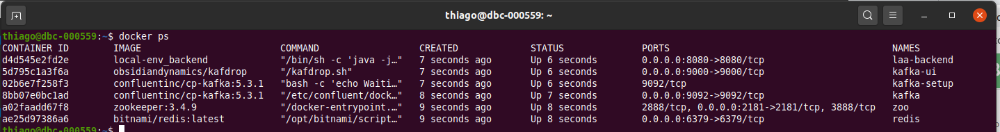

# LAA - Local environment

This document provides a step-by-step manual to run the backend for the LAA along all other services.

## Disclaimer
**I knew that usage of Docker is not allowed, but I chose it just for simplicity to demo this app. There's no need to setup a kafka cluster and Redis instance on AWS just to create a full topology and execute all the features end to end.**

## Prerequisites
To be able to run this you must have linux or windows pc with:
 * java 13 or superior
 * docker
 * docker-compose

## Process

1. Inside the main folder, get into the source folder
```bash
cd code/rest-api-ms
```
1. Execute maven wrapper to build the package
 * on linux :

```bash
# make maven wrapper executable
chmod +x ./mvnw
# build the package
./mvnw clean install package
```
* on windows :
```bash
./mvnw.cmd clean install
```
3. copy the generated fat jar to local-env folder
```bash
cp target/rest-api-ms.jar ../../local-env
```
4. go back to this folder
```bash
cd ../../local-env
```
5. run the compose file with all containers
```bash
docker-compose -f docker-compose-full.yml up -d
```
6. check the list of running containers
```bash
docker ps
```
You should see something similar to: 

7. Check if the backend is up and running acessing the health check endpoint.
```
http://localhost:8080/laa/health
```

## Live demo

To check the video with the whole solution working please check [this](../video/live_demo.mp4). 
